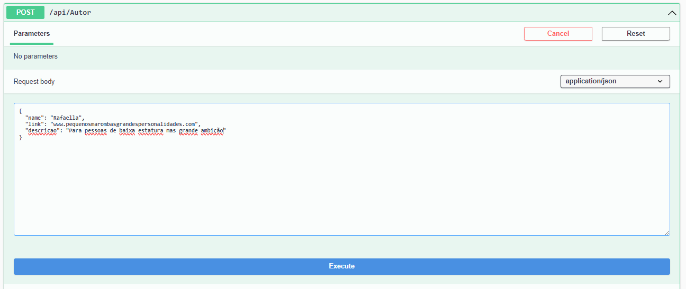
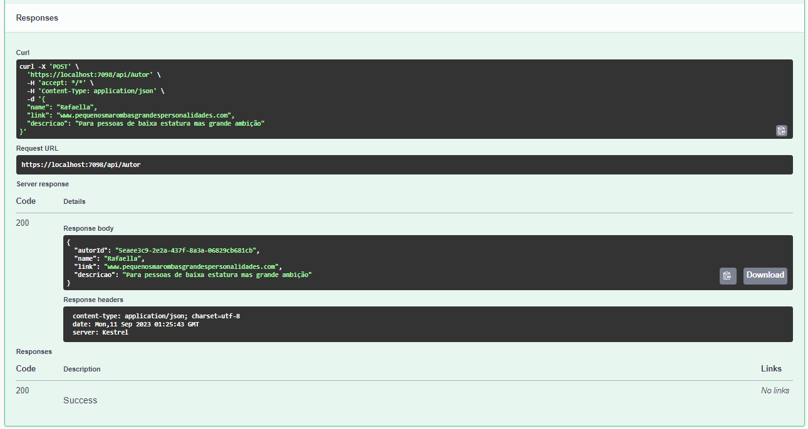
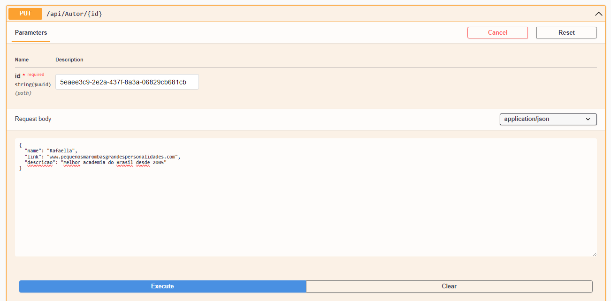
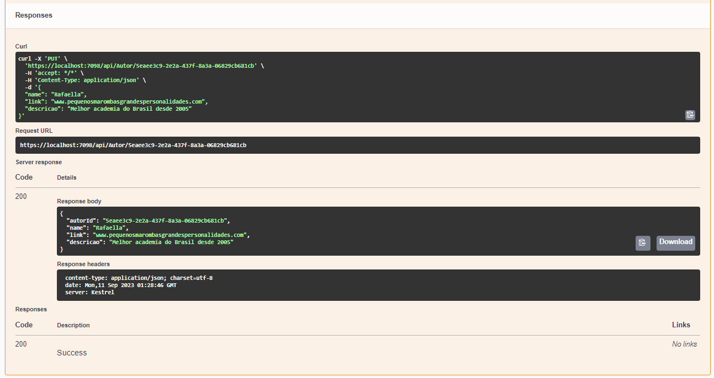
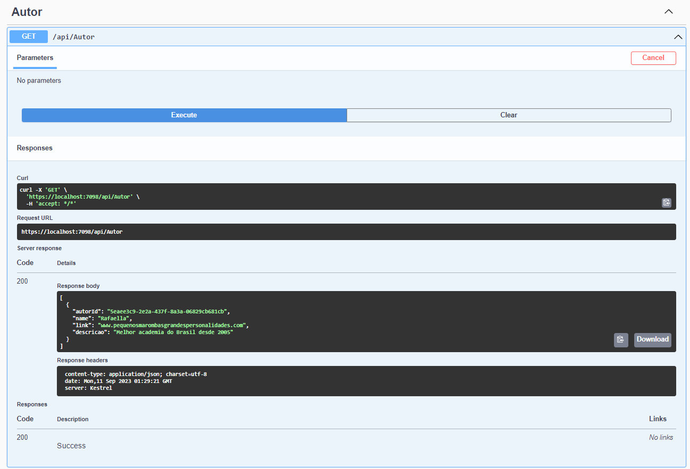
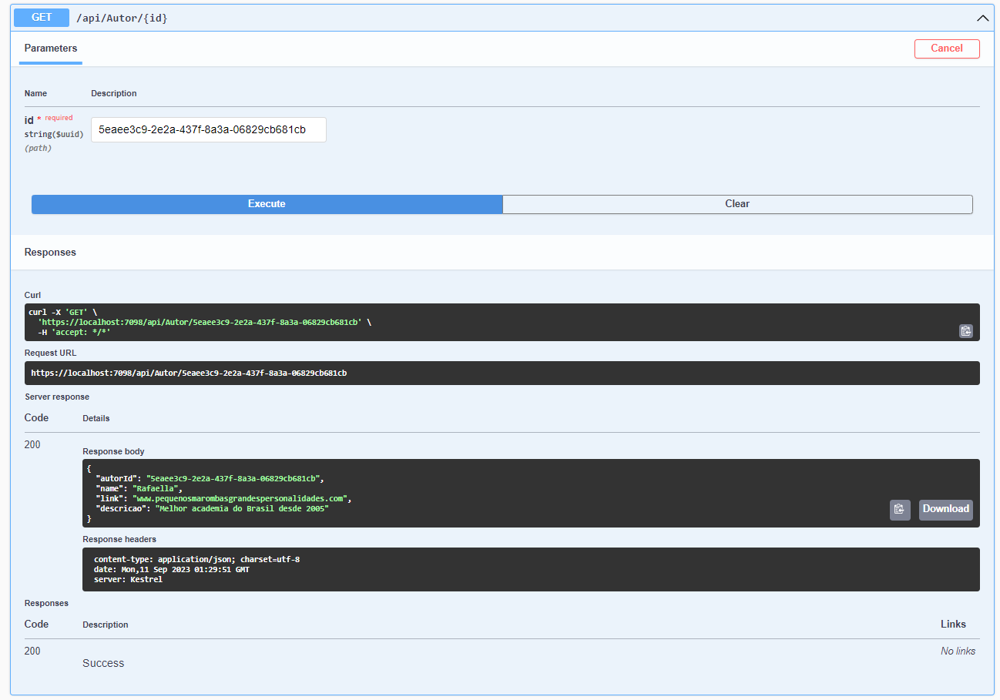
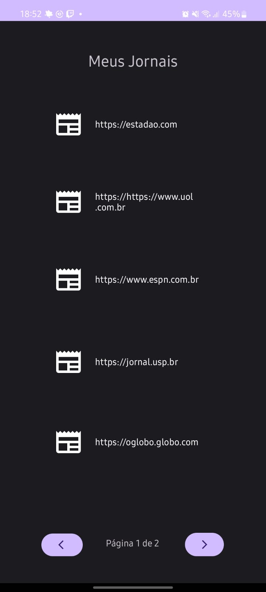
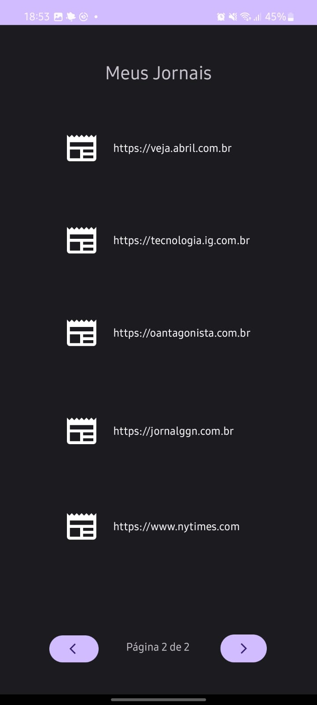

# API_Everyday
Dupla: Pedro e Rafa

## Descrição API

  A nossa API oferece um sistema de armazenamento para os jornais favoritos dos usuários, utilizando um banco de dados. Além de fornecer funcionalidades de autenticação e login, a API também permite que os usuários aproveitem ao máximo suas leituras. Com opções pré-definidas, os usuários podem facilmente salvar sua fontes favoritas. Além disso, a API oferece a flexibilidade de marcar artigos para “ler mais tarde” ou “ler mais”. Ao selecionar “ler mais tarde”, a notícia é armazenada para acesso futuro. Já a opção “ler mais” que direcionam o usuário diretamente para o site da matéria correspondente, oferecendo uma experiência de leitura perfeita e contínua.

Combinando conveniência e funcionalidade, a nossa API proporciona uma experiência de leitura personalizada e intuitiva para os usuários.

## Observações para o uso da API
  Devido ao fato de que não criei um banco de dados online, você terá que alterar algumas informações no arquivo "appsettings.json", no arquivo você deverá trocar um dos valore da ConnectionString. Altere o Server para o nome do servidor que você utilizará em sua máquina (lembre-se que estamos usando SQL Server). Por final, você deverá criar o banco, para tal, apenas abra o console do gerenciador de pacotes nuget e digite: Update-Database.

## Observação quanto ao Script:
  Já que usei Entity Framework, não criei um banco de forma manual, logo o "script" seria as migrations dentro do projeto, ao usar o comando Update-Database, ele roda as migrations e cria um banco de forma automática, seguindo as classes dentro da API.

## Prints do Funcionamento
### Insert:
  
  

### Select:
  

### Update:
  
  

### Select após Update:
  

### Select via ID:
  

### Activity para receber os dados da API:
  
  
